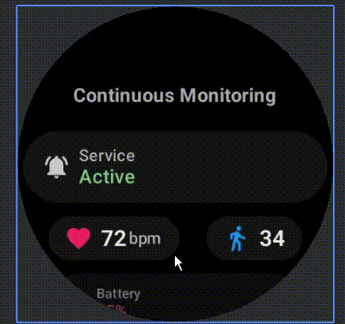

# Watch Data Streamer for Wear OS

[](https://opensource.org/licenses/MIT) <!-- Optional -->

**A Wear OS application designed for comprehensive sensor data acquisition and seamless transmission to a paired Android phone.**

This app runs directly on your Wear OS smartwatch, providing core functionality to:

*   Collect&Display vital health metrics: **Heart Rate** & **Steps**.
*   Capture contextual sensor data: **Accelerometer**, **Location** & **Device Battery**.
*   Support flexible monitoring modes:
    *   **Continuous Background Monitoring** for ongoing tracking.
    *   **On-Demand Event Recording** for specific incidents.
*   Reliably transmit all collected data to a companion Android phone application using the Wear OS Data Layer API.

Ideal for projects requiring rich sensor data from a smartwatch for further processing, analysis, or integration into larger health and activity platforms on a connected phone.

---

## 🚀 See It In Action!

Check out this demo to see the app collecting data on Wear OS and sending it to a connected Android phone:



---

## ✨ Key Features

*   **Wear OS Native App:** Runs independently on the smartwatch.
*   **Continuous Monitoring:**
    *   ❤️ Real-time Heart Rate.
    *   🚶 Daily Step Count.
*   **On-Demand Recording:**
    *   🤸 Accelerometer data capture for events.
    *   📍 Start/End Location for incidents.
*   **Device Insights:**
    *   🔋 Wearable Battery Level.
*   **Phone Communication:**
    *   📲 Streams data to a paired Android phone app via Wear Data Layer.
*   **Data Output:**
    *   Provides data in a structured format (e.g., JSON) for easy consumption by the phone app.
*   **Background Operation:**
    *   Utilizes foreground services for persistent and reliable data collection.

---

## 🛠️ Tech Stack

*   **Kotlin**
*   **Wear OS SDK**
*   **Android Jetpack:**
    *   Jetpack Compose for Wear OS (for the app's UI)
    *   Coroutines & StateFlow
*   **Google Play Services:**
    *   Wearable Data Layer API
    *   Fused Location Provider API
*   **Gson:** For data serialization.

---

## 📲 Phone App Integration

To receive data from this Wear OS app, your companion Android phone application will need to:

1.  **Include Play Services Wearable Dependency:**
    ```gradle
    implementation 'com.google.android.gms:play-services-wearable:18.1.0' // Or latest
    ```
2.  **Listen for Data Layer Messages:**
    *   Implement a `WearableListenerService` or add listeners to `MessageClient`/`DataClient`.
    *   Listen on predefined paths (e.g., `/watch_info/health`, `/watch_info/incident`) for incoming data.
    *   (Specify the exact paths your app uses here or refer to a constants file).
3.  **Process Received Data:**
    *   Deserialize the received data (e.g., from JSON) into appropriate data models on the phone side.

---

## 🔒 Permissions (on Wear OS device)

This app requires the following permissions on the Wear OS device to function:

*   `android.permission.BODY_SENSORS`
*   `android.permission.ACTIVITY_RECOGNITION`
*   `android.permission.ACCESS_FINE_LOCATION`
*   `android.permission.FOREGROUND_SERVICE`
*   `android.permission.FOREGROUND_SERVICE_HEALTH`
*   `android.permission.WAKE_LOCK`
*   `android.permission.POST_NOTIFICATIONS` (API 33+)

---
## 💡 Future Ideas
* Adaptive sampling.
* Local caching on watch for offline sync.
* User-configurable settings within the Wear OS app.

---
## 📄 License
This project is licensed under the MIT License. (Optional: Add a LICENSE.md file)
